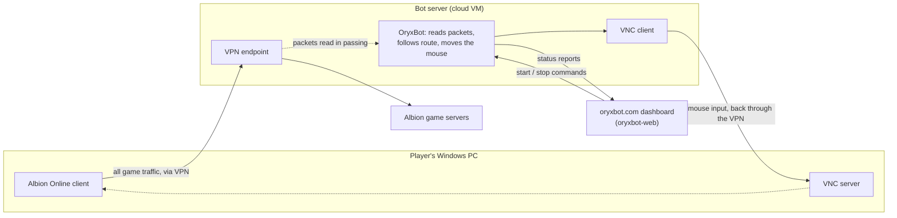

# oryxbot

A bot that walks a character through Albion Online, an online role-playing game, to where you tell it to go.

## What it is

- Self-driving for the game: give it a route and it steers the character along it, correcting drift, working around obstacles and stopping with a report if it dies or loses connection. Any destination is the goal; today it follows recorded routes.
- Fully external by design: it runs on a separate machine, learns where the character is by reading the game's network packets in passing, and acts only by moving the mouse over VNC. Nothing is installed in or injected into the game.
- Two eras in one repo: the client that shipped to subscribers (186 commits, Feb 2021–Apr 2024, on `prod`) and a 2026 .NET rewrite on `main` with 90 xUnit tests, 18 of them end to end on a simulator, plus a 1,486-zone world graph and map tooling.

## Background

- Albion Online (Sandbox Interactive, 2017) is a free-to-play sandbox MMORPG for PC and mobile, built around a player-driven economy and open-world PvP.
- Its world is made of map zones joined by portals, and walking between cities is slow and repetitive. The original bot automated in-game delivery quests that pay for exactly that trek.
- The rewrite drops the quest part, which meant clicking through an NPC menu at fixed screen positions, and keeps the generic core: packets in, position out, follow a route. Quests can be layered back on later.

## How it works



- **Two machines, one tunnel.** The PC dials a VPN to the bot server, so its game traffic passes through there and the bot can read it; the bot connects back through the tunnel to the PC's VNC server to move the cursor. That is the shipped setup; the rewrite's docs target a game in a Linux VM, deployment undecided.
- **What the bot sees.** Only its own coordinates, from the movement packets the game sends several times a second. Drift, dead reckoning and idle-based stuck detection all follow from that one fact.
- **The Pilot.** A small state machine: following the route, correcting course, unsticking, waiting out a zone change, or a terminal stop (lost, dead, disconnected). Each tick yields one serialisable decision with a reason. Unsticking backs up, arcs around an assumed obstacle that grows with each retry, then probes.
- **Simulation first.** Because deciding and executing are separate calls and time is injected, a deterministic simulator with latency, drift and wall profiles runs the whole loop end to end; runs are recorded to JSON and replay in the map viewer.
- **Routes, not maps.** The Pilot follows routes a human recorded, because the extracted world graph (1,486 zones, 1,514 portal edges) knows which portal leads where but nothing about walkable terrain inside a zone. A portal-hop pathfinder over it exists but is not wired to the Pilot, and no live graph loader exists.
- **RailRip.** The 2026 site credits [RailRip](https://railrip.com), an external "anticheat bypass as a service", for a different tunnel model (a copy of the traffic rather than a VPN detour). None of that code is in this repo.

## Tech stack

- Rewrite: .NET 10 / C#, Microsoft.Extensions hosting and DI, Serilog; tests with xUnit, FluentAssertions, NSubstitute and `FakeTimeProvider`.
- Shipped client (`prod`): .NET 7, SharpPcap and Albion.Network for packet decoding, a Java VNC client behind an HTTP bridge, Pusher client for commands, NLog.
- Tools and site: Python (OpenCV, scikit-image, Pillow) and a System.CommandLine CLI; Vite, React 19, TypeScript, Tailwind 4, Leaflet, Clerk.
- CI: GitHub Actions builds the shipped client on push to `prod` and uploads it to oryxbot.com; nothing runs the rewrite's tests yet.

## Repository layout

- `app/src/OryxBot.Pilot/` — the state machine; start with `NavigationController.cs` and `States/`.
- `app/tests/e2e/` — the simulator, its profiles and the recorded-run tests.
- `app/docs/` — architecture and phase plans; they predate the code (the unsticking algorithm and the Linux-VM target differ from what is implemented).
- `tools/` — `game-data-extractor` (reads `ao-bin-dumps` XML into zone and world-graph JSON; its `.bin` decryptor is a placeholder), `map-extractor`, `road-extractor`, `map-viewer` (Leaflet map with simulation replay).
- `website/apps/platform/` — oryxbot.com SPA: landing, docs, mocked marketplace, Clerk sign-in; no backend, and its `packages/shared` is git-ignored, so it does not build from a clean clone.

## Running it

```bash
dotnet build app/OryxBot.slnx && dotnet test app/OryxBot.slnx                    # bot + simulation tests
cd tools/map-extractor && pip install -r requirements.txt && python cli.py all   # map tiles
```

Open `tools/map-viewer/index.html` to browse the map or replay a simulation recording.

## Related

- [oryxbot-web](https://github.com/kpolicar/oryxbot-web) — the Laravel platform that sold subscriptions to the `prod` client and provisioned and remote-controlled each subscriber's bot server.

## Status

Rewrite in progress: a six-day, agent-assisted rebuild in March 2026 has route following, the Pilot state machine, routes and the simulator implemented and tested; live packet capture, VNC input, the top-level engine and a real world-graph loader are stubs. The shipped 2021–2024 client is on `prod`.
Personal project by Klemen Poličar. Not affiliated with Sandbox Interactive; Albion Online is their trademark.
