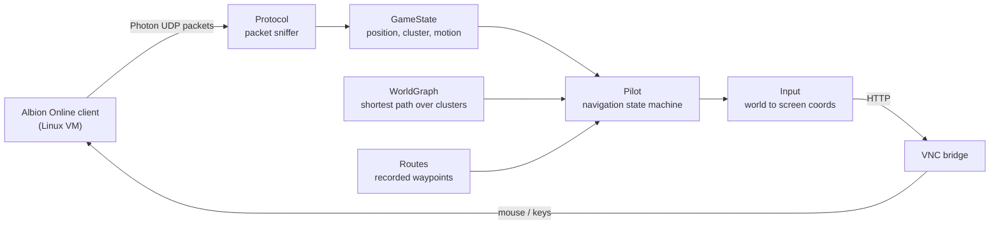

# oryxbot

Autonomous navigation bot for the MMORPG Albion Online, plus the game-data tooling and website around it.

## What it is

- A bot that drives an Albion Online character to a destination on its own: it plans a route across the world map, follows it, corrects drift, gets unstuck, crosses zone portals and reacts to death or disconnects.
- Fully external. It never touches the game process: game state comes from passively sniffing the game's Photon UDP traffic, and control goes back as mouse and keyboard input over VNC.
- A monorepo: the .NET bot (`app/`), a React site for oryxbot.com (`website/`), and Python/.NET tools that turn game files into a navigable world map (`tools/`).

## Background

- Albion Online (Sandbox Interactive, 2017) is a free-to-play sandbox MMORPG for PC and mobile with a player-driven economy and full-loot PvP zones.
- Its world is a graph of zones ("clusters") joined by portals, from safe blue zones to lawless black ones. Travel between cities is slow and repetitive; faction "transport missions", which haul cargo between cities for faction hearts and silver, are the classic example.
- OryxBot started in 2021 as a trade-mission bot for exactly that. The 2026 rebuild on `main` generalises it into a "Pilot": give it a destination and it gets there. The original client lives on the `prod` branch.

## How it works



- **Pathfinder vs Pilot.** The Pathfinder is pure computation: a shortest-path search over a world graph of clusters and their portal exits, built from extracted game data. The Pilot executes: each tick it evaluates one state (`FollowingRoute`, `CorrectingCourse`, `Unsticking`, `Transitioning`, `Evading`, `Lost`, `Killed`, `Disconnected`) and emits a single serialisable `NavigationDecision`.
- **Events and interfaces, no game coupling.** Game traffic becomes domain events (`CharacterMoved`, `ClusterChanged`, `CharacterDied`) on an in-process event bus; everything downstream depends on `ICharacterTracker`, `IGameController`, `IInputAdapter` and an injected `TimeProvider`.
- **Simulation first.** A deterministic `GameSimulator` with profiles (perfect, realistic, high latency, adversarial, constant drift, position jumps) and wall obstacles runs end-to-end tests for route following, course correction, stuck recovery and death recovery. Runs are recorded to JSON and can be replayed in the map viewer.
- **World data pipeline.** `game-data-extractor` decrypts the game's `.bin` cluster files (or reads `ao-bin-dumps` XML) into `clusters.json` and `world-graph.json`; `map-extractor` downloads and colour-grades map tiles; `road-extractor` detects roads on minimaps with OpenCV; `map-viewer` shows it all on a Leaflet map.

## Tech stack

- Bot: .NET 10 / C#, Microsoft.Extensions Hosting, DI and Options, Serilog, System.Text.Json; tests with xUnit, FluentAssertions, NSubstitute and `FakeTimeProvider`.
- Legacy client (`prod`): .NET 7, SharpPcap and Albion.Network for Photon decoding, PusherClient for remote commands, NLog.
- Website: Vite, React 19, TypeScript, Tailwind 4, React Router, Framer Motion, Leaflet, Clerk (client-side auth), pnpm workspace.
- Tools: Python (OpenCV, scikit-image, NumPy, Pillow) and a .NET CLI built on System.CommandLine.
- CI: GitHub Actions builds the legacy client on push to `prod` and uploads the tarball to oryxbot.com's deploy endpoint.

## Repository layout

- `app/` — the bot: `src/` (Core, WorldGraph, Pilot, Routes, Protocol, Input, GameState, RemoteDesktop), `hosts/OryxBot.Host` (entry point and `appsettings.json`), `tests/` including the `e2e/` simulator, `docs/` (architecture and phase plans).
- `website/apps/platform/` — oryxbot.com SPA: landing, docs, marketplace (mocked data), pilot page, Clerk sign-in. No backend.
- `tools/` — `game-data-extractor/`, `map-extractor/`, `road-extractor/`, `map-viewer/`, `game/` (Unity asset scripts).

## Running it

```bash
dotnet build app/OryxBot.slnx && dotnet test app/OryxBot.slnx                    # bot + simulation tests
cd website && pnpm install && pnpm dev:platform                                  # website
cd tools/map-extractor && pip install -r requirements.txt && python cli.py all   # map tiles
```

Open `tools/map-viewer/index.html` to browse the map or replay a simulation recording.

## Status and related

- Rebuild in progress (March 2026): navigation logic, world graph, routes and the simulator are implemented and tested; live packet capture, the VNC input adapter and the top-level `PilotEngine` are still stubs (phases 3–5 in `app/docs/`).
- [oryxbot-web](https://github.com/kpolicar/oryxbot-web) is the Laravel platform that sold, deployed and remote-controlled the legacy client: it provisions a DigitalOcean server per subscriber, ships builds from this repo's CI to it, and streams bot status to a dashboard.
- Personal project by Klemen Poličar. Not affiliated with Sandbox Interactive; Albion Online is their trademark.
